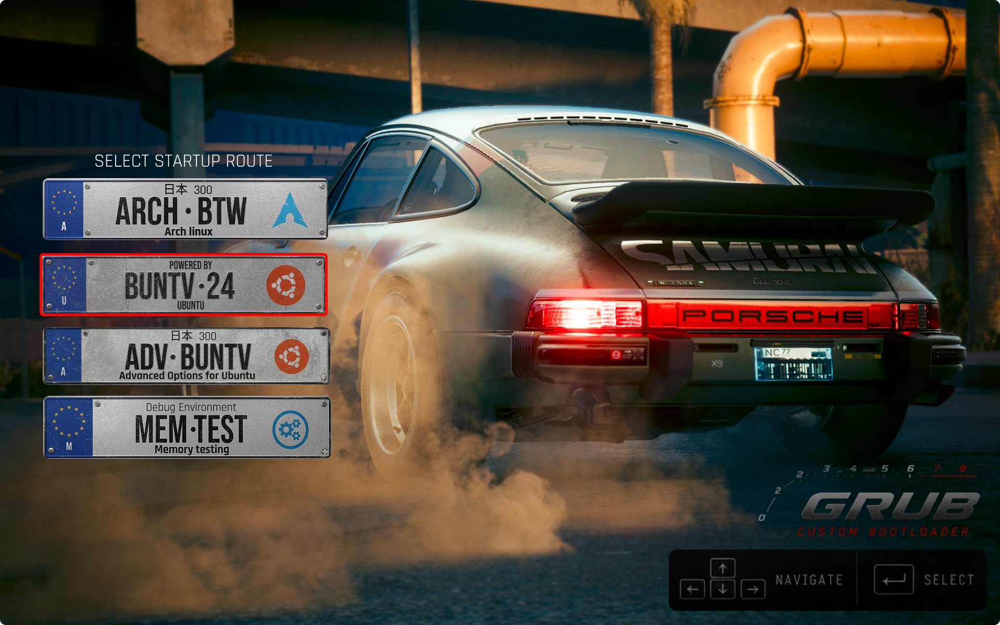
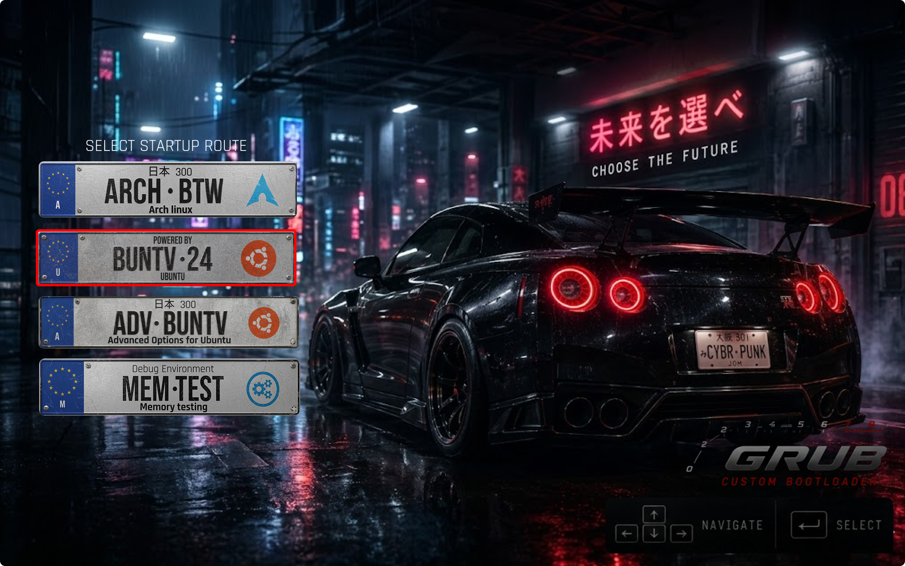
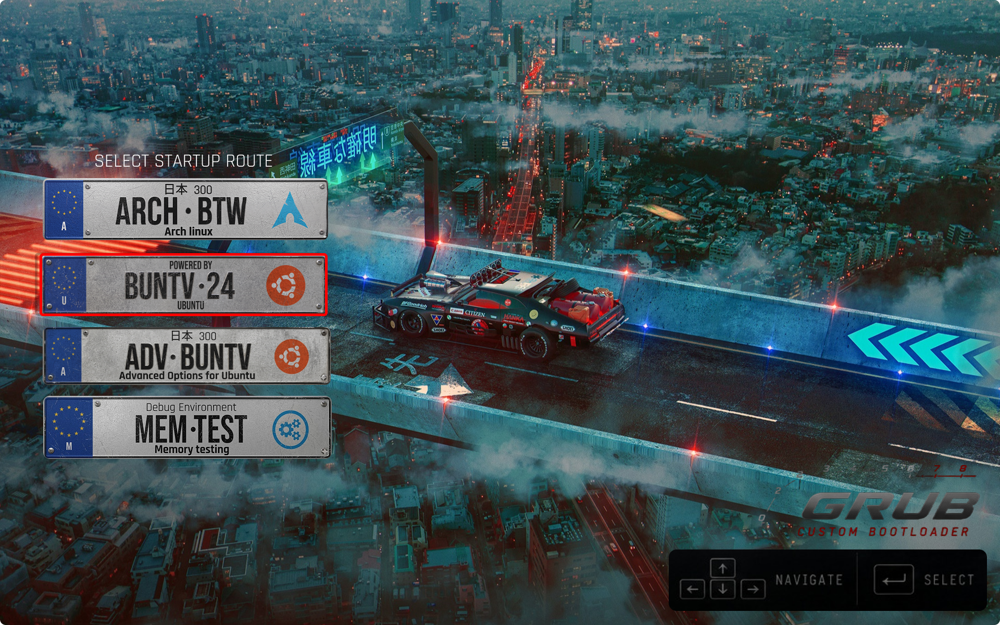
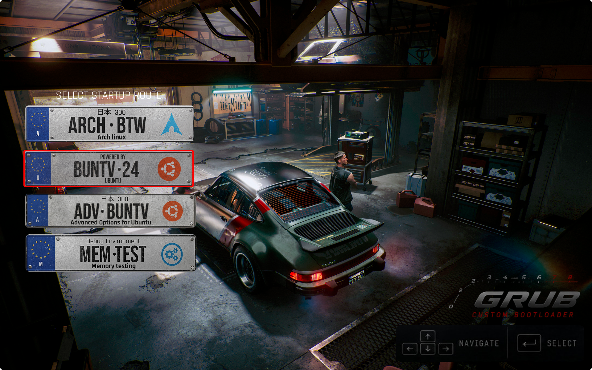

<div align="center">

# Cyberpunk 2077 / JDM GRUB Theme

**A GRUB bootloader theme inspired by Cyberpunk 2077 and JDM car culture.**

</div>

---

## Previews

Get a glimpse of the sleek design with custom car plate icons, and a variety of cool car backdrops:

<div align="center">
  
  
  <br><br>
  
  
</div>

---

## Installation

1. **Copy to themes directory:**
   ```bash
   sudo cp -r JDM-theme-Grub /boot/grub/themes/
   ```

2. **To change your background, edit theme.txt and replace the background image path with your desired path.** 
   ```bash
     desktop-image: "background.png"
   ```
   *Note: The background image should be in .png format 
3. **Update config file:**
   Open `/etc/default/grub` and add this line:
   ```text
   GRUB_THEME="/boot/grub/themes/JDM-theme-Grub/theme.txt"
   ```

4. **Apply configuration:**
   ```bash
   sudo update-grub
   ```

✨ ***Enjoyyy*** ✨

***If ur desired name plate is not there pls do raise an issue stating ur OS. I'll be more than happy to add it to the collection. ***
---

## Note

> [!NOTE]
> This is just the first version, ill add more and change a lot of things. If you have any suggestions or ideas, please feel free to share them with me.

---

## 🤝 Credits & Thanks

*   **Wallpapers:** Huge thanks to [Wallhaven.cc](https://wallhaven.cc/) and all the wallpaper artists.
*   **Tooling:** Massive shoutout to [grub2-theme-preview](https://github.com/hartwork/grub2-theme-preview) for making an extremely useful tool!

---

## 🔗 Follow Me

[](https://www.opendesktop.org/u/RAGUL01212321/products)
[](https://github.com/Ragul01212321)
[](https://x.com/Ragul01212321)
[](https://www.reddit.com/user/Cultural-Lobster7795/)